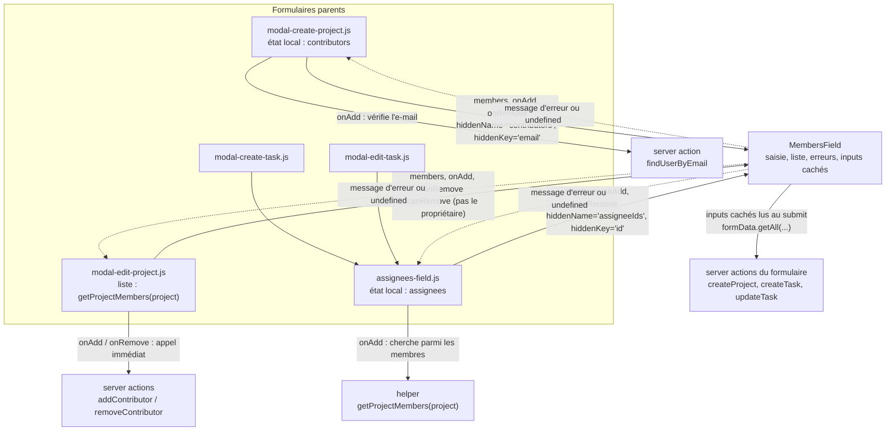
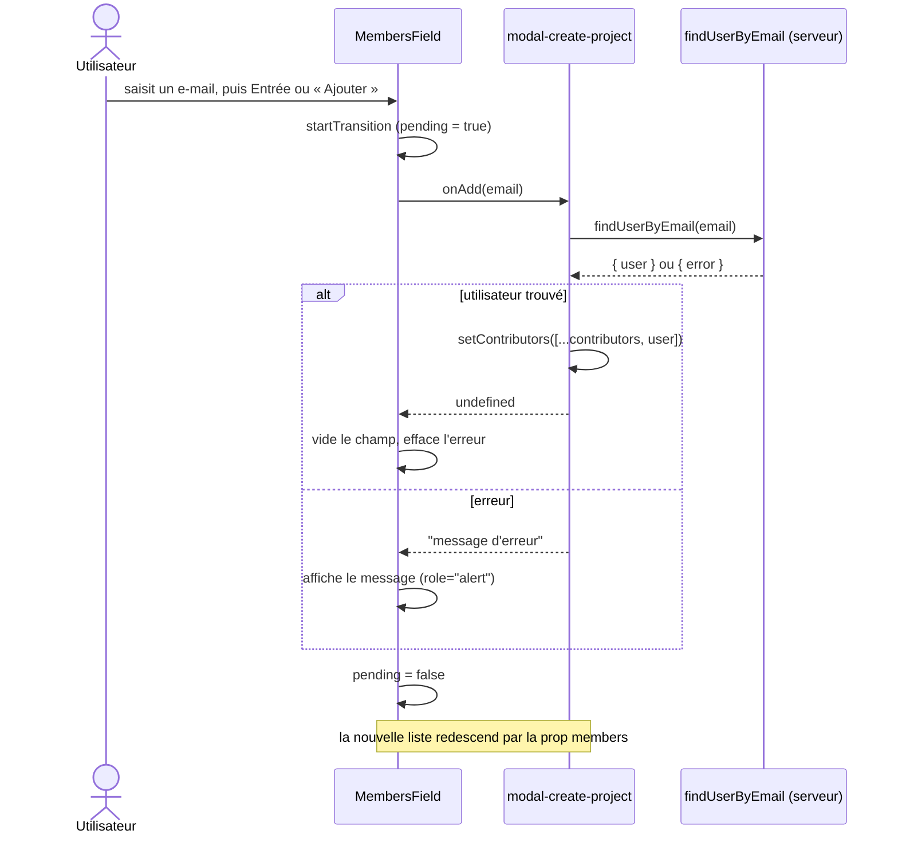

# MembersField

`src/app/ui/members-field.js` est le composant qui affiche une liste de personnes, avec un champ pour en ajouter par e-mail et un bouton « Retirer » sur chaque ligne.

Il sert à trois endroits : les contributeurs à la création d'un projet, les contributeurs à la modification d'un projet, et les personnes assignées à une tâche.

## Principe : la présentation dans le composant, la logique dans le parent

`MembersField` ne stocke pas la liste et ne décide pas de ce qui se passe lors d'un ajout ou d'un retrait. Il reçoit :

| Prop | Rôle |
|---|---|
| `members` | la liste à afficher, `[{ id, name, email }]` |
| `onAdd(email)` | appelée au clic sur « Ajouter » ou à l'appui sur Entrée |
| `onRemove(member)` | appelée au clic sur « Retirer » |
| `canRemove(member)` | renvoie `false` pour masquer « Retirer » (par défaut : toujours `true`) |
| `hiddenName`, `hiddenKey` | si `hiddenName` est fourni, un `<input type="hidden">` par membre est ajouté au formulaire |
| `error` | erreurs zod renvoyées par la server action du formulaire parent |
| `id`, `label`, `listLabel` | identifiant du champ et libellés |

`onAdd` et `onRemove` suivent la même convention : elles renvoient **un message d'erreur, ou `undefined` en cas de succès**. Le composant affiche ce message sans avoir besoin d'en connaître la cause.

Le composant ne garde dans son état que ce qui lui est propre :

- `email` : le texte saisi ;
- `localError` : le dernier message renvoyé par `onAdd` ou `onRemove` ;
- `pending` (via `useTransition`) : `true` pendant un traitement, pour désactiver les boutons.

## Schéma d'ensemble

Les flèches pleines montrent ce que le parent fournit ou appelle. Les flèches en pointillé montrent la valeur que `onAdd` ou `onRemove` renvoie au composant.

## Les trois utilisations

| Parent | D'où vient la liste | Ce que fait `onAdd` | Comment la liste est enregistrée |
|---|---|---|---|
| `modal-create-project.js` | état local `contributors` | refuse un doublon, vérifie que l'utilisateur existe (`findUserByEmail`), puis l'ajoute à l'état local | à la soumission du formulaire : inputs cachés `contributors` (e-mails), lus par `createProject` |
| `modal-edit-project.js` | `getProjectMembers(project)` : propriétaire + membres, sans doublon | appelle directement l'API (`addContributor`) | immédiatement, à chaque ajout ou retrait ; pas d'inputs cachés |
| `assignees-field.js` | état local `assignees` | cherche l'e-mail parmi les membres du projet, refuse un doublon, puis l'ajoute à l'état local | à la soumission : inputs cachés `assigneeIds` (id), lus par `createTask` ou `updateTask` |

Dans la modale de modification d'un projet, `canRemove` masque « Retirer » pour le propriétaire, qui ne peut pas quitter son propre projet.

## Déroulement d'un ajout

Exemple dans la modale de création de projet :

## Points de détail

- **Entrée dans le champ** : le champ se trouve dans le `<form>` du parent. Sans `preventDefault()`, Entrée soumettrait tout le formulaire. `handleKeyDown` l'en empêche et lance l'ajout à la place.
- **`type="button"`** sur « Ajouter » et « Retirer » : sans cet attribut, un bouton placé dans un formulaire est un bouton `submit`.
- **`onAdd` synchrone** : `AssigneesField` passe une fonction qui ne renvoie pas de Promise. `await` fonctionne quand même, car il renvoie directement une valeur qui n'est pas une Promise.
- **Deux sources d'erreur** :
  - `localError` est l'erreur immédiate, par exemple « déjà dans la liste ». Elle porte `role="alert"` pour être annoncée par les lecteurs d'écran.
  - `error` contient les erreurs de validation renvoyées par la server action après la soumission.
- **`aria-describedby`** relie le champ aux messages d'erreur affichés. Les id sont assemblés avec `.filter(Boolean).join(" ")`. Quand il n'y a aucune erreur, `|| undefined` évite d'écrire un attribut vide.
- **Inputs cachés** : plusieurs `<input type="hidden">` portent le même `name`. La server action récupère toutes les valeurs avec `formData.getAll(name)`. C'est ce qui relie une liste gérée en état React à un `<form action={...}>` classique.
